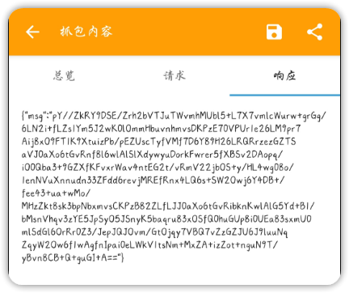
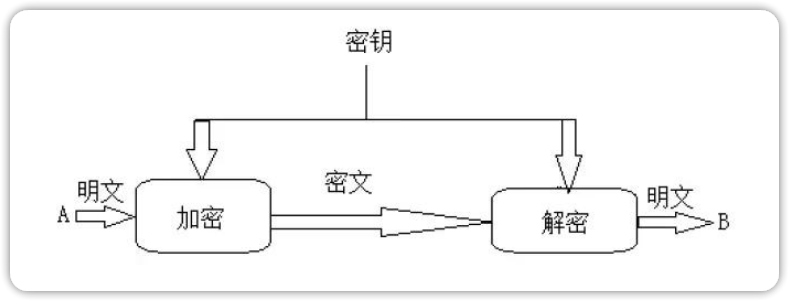
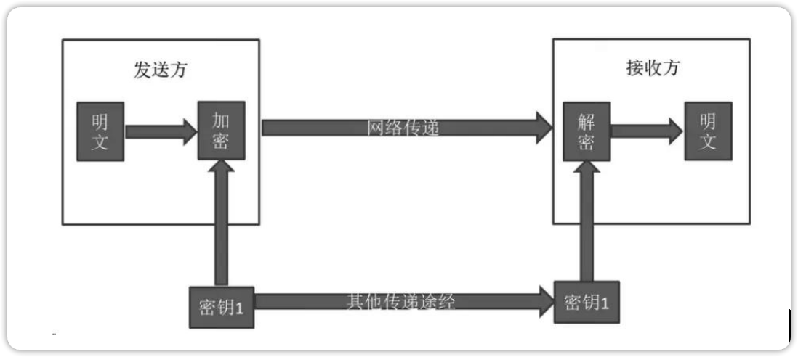
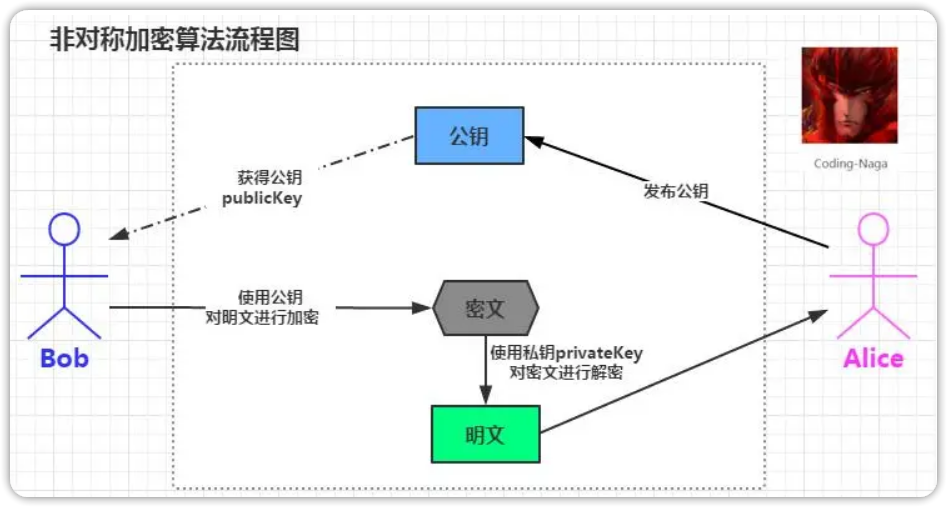

# 一、课程目标

1.密码学基础

2.常见编码与算法

3.非标准加密对抗

# 二、工具

1.教程Demo(更新)

2.MT管理器/NP管理器

3.算法助手

4.雷电模拟器

5.Android Studio

6.jadx-gui

# 三、课程内容

## 1.为什么要学这个？
-   CTF
-   爬虫:算法还原、协议分析
-   网络安全:渗透测试、安全防护
-   

## 2.密码学基础
### 1.什么是密码学?
密码学(cryptography)是一种将信息表述为不可读的方式，并使用一种秘密的方法将信息恢复出来的科学。密码学提供的最基本的服务是数据机密性服务，就是使通信双方可以互相发送消息，并且避免他人窃取消息的内容。加密算法是密码学的核心。
-   明文：原始消息
-   密文：加密后的消息
-   加密：从明文到密文的变换过程
-   解密：从密文到明文的变换过程
-   密钥：相用来完成加解密等过程的秘密信息
 

## 3.常见编码
### 1.Base64编码

[CyberChef](https://gchq.github.io/CyberChef/)
定义:
Base64是一种用64个字符表示任意二进制数据的方法，是一种编码，并非加密字符编码，由 A-Z a-z 0-9 + / 和补充字符 “=” 组成，Base64编码后的字符数是4的倍数（不足会补"="）

明文:
```
吾爱破解论坛
```
密文:
```
5ZC+54ix56C06Kej6K665Z2b
```
逻辑实现:
```java
import java.util.Base64;

public class Base64Example {
    public static void main(String[] args) {
        String text = "吾爱破解论坛";
        
        // 编码
        String encodedString = Base64.getEncoder().encodeToString(text.getBytes());
        System.out.println("Encoded string: " + encodedString);
        
        // 解码
        byte[] decodedBytes = Base64.getDecoder().decode(encodedString);
        String decodedString = new String(decodedBytes);
        System.out.println("Decoded string: " + decodedString);
    }
}
```

自实现base64：
```java
public class Base64Example {
	//base64码表
    private static final String base64Chars = "ABCDEFGHIJKLMNOPQRSTUVWXYZabcdefghijklmnopqrstuvwxyz0123456789+/";

    public static void main(String[] args) {
        String originalInput = "吾爱破解论坛";

        // 编码
        String encodedString = encodeBase64(originalInput.getBytes());
        System.out.println("Encoded string: " + encodedString);

        // 解码
        byte[] decodedBytes = decodeBase64(encodedString);
        String decodedString = new String(decodedBytes);
        System.out.println("Decoded string: " + decodedString);
    }

    private static String encodeBase64(byte[] inputBytes) {
        StringBuilder sb = new StringBuilder();
        int paddingCount = (3 - inputBytes.length % 3) % 3;

        for (int i = 0; i < inputBytes.length; i += 3) {
            int b = ((inputBytes[i] & 0xFF) << 16) | ((i + 1 < inputBytes.length ? inputBytes[i + 1] & 0xFF : 0) << 8) | (i + 2 < inputBytes.length ? inputBytes[i + 2] & 0xFF : 0);
            sb.append(base64Chars.charAt((b >> 18) & 0x3F)).append(base64Chars.charAt((b >> 12) & 0x3F)).append(base64Chars.charAt((b >> 6) & 0x3F)).append(base64Chars.charAt(b & 0x3F));
        }

        for (int i = 0; i < paddingCount; i++) {
            sb.setCharAt(sb.length() - i - 1, '=');
        }

        return sb.toString();
    }

    private static byte[] decodeBase64(String inputString) {
        ByteArrayOutputStream bos = new ByteArrayOutputStream();
        int paddingCount = 0;

        for (int i = 0; i < inputString.length(); i += 4) {
            int b = (base64Chars.indexOf(inputString.charAt(i)) << 18) | (base64Chars.indexOf(inputString.charAt(i + 1)) << 12) | (i + 2 < inputString.length() && inputString.charAt(i + 2) != '=' ? base64Chars.indexOf(inputString.charAt(i + 2)) << 6 : 0) | (i + 3 < inputString.length() && inputString.charAt(i + 3) != '=' ? base64Chars.indexOf(inputString.charAt(i + 3)) : 0);
            bos.write((b >> 16) & 0xFF);
            bos.write((b >> 8) & 0xFF);
            bos.write(b & 0xFF);

            if (inputString.charAt(i + 2) == '=') {
                paddingCount++;
            }

            if (inputString.charAt(i + 3) == '=') {
                paddingCount++;
            }
        }

        byte[] result = bos.toByteArray();

        if (paddingCount > 0) {
            byte[] trimmedResult = new byte[result.length - paddingCount];
            System.arraycopy(result, 0, trimmedResult, 0, trimmedResult.length);
            return trimmedResult;
        } else {
            return result;
        }
    }
}


```
### 2.Hex编码
定义:
hex编码，又称十六进制编码(也称base16)，一般用于方便人们查看二进制文件内容，它将字节数据中的每4个bit使用数字(0-9)、字母(A-F)共16个字符等效表示，由于一个字节有8个bit，所以一个字节会被编码为2个hex字符
PS:在 ASCII 编码中，只有0到127之间的数字是表示英文字母、数字和符号的，超出这个范围的字符需要使用其他编码方式,例如汉字就需要使用 UTF-8 或 UTF-16

明文:
```
吾爱破解论坛
```
密文:
```
E590BEE788B1E7A0B4E8A7A3E8AEBAE59D9B
```
逻辑实现:
`%02X` 是一个格式化字符串，其中 `%` 是转义符，`02` 是最小宽度，表示输出的字符串至少包含两个字符，不足两个字符时用 `0` 填充，`X` 表示输出的字符集为大写的十六进制数。(算是一个特征)
```java
// 将普通字符串转换为Hex字符串
public static String stringToHex(String input) {  
    StringBuilder output = new StringBuilder();  
    byte[] bytes = input.getBytes(StandardCharsets.UTF_8);  
    for (byte b : bytes) {  
        output.append(String.format("%02X", b));  
    }  
    return output.toString();  
}  
// 将Hex字符串转换为普通字符串  
public static String hexToString(String input) {  
    byte[] bytes = new byte[input.length() / 2];  
    for (int i = 0; i < input.length(); i += 2) {  
        bytes[i / 2] = (byte) Integer.parseInt(input.substring(i, i + 2), 16);  
    }  
    return new String(bytes, StandardCharsets.UTF_8);  
}

```


### 3.Unicode编码
定义:
Unicode（统一码、万国码、单一码）是一种在计算机上使用的字符编码。

明文:
```
吾爱破解论坛
```
密文:
```
\u543E\u7231\u7834\u89E3\u8BBA\u575B
```
逻辑实现:
```java
// 将字符串转换为Unicode格式
public static String stringToUnicode(String input) {  
    StringBuilder output = new StringBuilder();  
    for (int i = 0; i < input.length(); i++) {  
        output.append(String.format("\\u%04X", (int) input.charAt(i)));  
    }  
    return output.toString();  
}
// 将Unicode格式的字符串转换为原始字符串  
public static String unicodeToString(String input) {  
    StringBuilder output = new StringBuilder();  
    for (int i = 0; i < input.length(); i += 6) {  
        String str = input.substring(i + 2, i + 6);  
        output.append((char) Integer.parseInt(str, 16));  
    }  
    return output.toString();  
}

```
### 4.Byte数组
PS：常用于字符串加密
明文：
```
吾爱破解论坛
```
密文：
```java
byte[] byteArray = new byte[]{-27,-112,-66,-25,-120,-79,-25,-96,-76,-24,-89,-93,-24,-82,-70,-27,-99,-101};  
```
```java
public static void main(String[] args) {  
	//stringtobyte数组
    String originalInput = "吾爱破解论坛";  
    byte[] bytes = originalInput.getBytes();  
    System.out.println(Arrays.toString(bytes));  
    
    //byte数组tostring
    byte[] byteArray = new byte[]{-27,-112,-66,-25,-120,-79,-25,-96,-76,-24,-89,-93,-24,-82,-70,-27,-99,-101};  
    String str = new String(byteArray);  
    System.out.println(str);  
    
}

```
## 4.加密算法
### 1.消息摘要算法&单向散列函数&哈希算法
定义:
单向散列函数算法也称Hash（哈希）算法(消息摘要算法)，是一种将任意长度的消息压缩到某一固定长度（消息摘要）的函数（该过程不可逆）。 Hash函数可用于数字签名、 消息的完整性检测、消息起源的认证检测等。 
常见的算法:MD5、HMAC、SHA-X(SHA-1,SHA-2)
#### MD5加密
特性:
-   压缩性:无论数据长度是多少,计算出来的MD5值长度相同(16位、32位)
-  抗修改性:即便修改一个字节，计算出来的MD5值也会巨大差异
-  抗碰撞性:知道数据和MD5值，很小概率找到相同MD5值相同的原数据
-  易计算性:由原数据容易计算出MD5值(逆推)

明文:
```
吾爱破解论坛
```
密文:
```
0bc50e2bf301b3f7c4309a9f4c9b19b2
```
逻辑实现:
```java
    public static void main(String[] args) throws Exception {
        MessageDigest md = MessageDigest.getInstance("MD5");
        md.update("吾爱破解论坛".getBytes());
        byte[] res = md.digest();
        System.out.println(byteToHexString(res));
    }
    public static String byteToHexString(byte[] by) {
        StringBuilder SB = new StringBuilder();

        for (int k : by) {
            int j = k;
            if (k < 0) {
                j = k + 256;
            }

            if (j < 16) {
                SB.append("0");
            }

            SB.append(Integer.toHexString(j));
        }
        return SB.toString();
    }

```

### 2.对称加密算法
定义:
加密和解密使用相同密钥的密码算法叫对称加解密算法，简称对称算法。对称算法速度快，通常在需要加密大量数据时使用。所谓对称，就是采用这种密码方法的双方使用同样的密钥进行加密和解密。

对称加密算法可以分为以下几种类型：
- DES（数据加密标准）：DES是一种对称加密算法，使用56位密钥，将数据分成64位块，然后进行加密。由于DES的密钥长度比较短，易受到暴力破解攻击。
- 3DES（三重DES）：3DES是基于DES算法的改进版本，使用三个56位的密钥，对数据进行三次加密，从而增加了加密强度。3DES比DES更加安全，但是加密速度较慢。
- AES（高级加密标准）：AES是一种高级的对称加密算法，使用128、192或256位密钥，可以对不同长度的数据块进行加密。AES比DES和3DES更加安全，且加密速度更快。
- RC4：RC4是一种流加密算法，使用相同的密钥对数据进行加密和解密。RC4的密钥长度可以是40位、64位、128位等不同长度。RC4在实际应用中已经被证明存在漏洞，不再被推荐使用。

#### (1)AES加解密
明文:
```
吾爱破解论坛
```
密文:
```
VPPMeI+jgyAtCYeM+VvamDapwXp+n4Q/oUHULimyLA4=
```
逻辑实现:
```java
import javax.crypto.Cipher;  
import javax.crypto.spec.SecretKeySpec;  
import java.util.Base64;
public class Aes {  
    private static final String ALGORITHM = "AES";  
    private static final String TRANSFORMATION = "AES/ECB/PKCS5Padding";  //加密模式
    private static final String SECRET_KEY = "1234567wuaipojie";  //密钥
  
    public static void main(String[] args) throws Exception {  
        String originalMessage = "吾爱破解论坛";  
  
        // Encrypt the message  
        byte[] encryptedMessage = encrypt(originalMessage);  
        System.out.println("加密结果: " + Base64.getEncoder().encodeToString(encryptedMessage));  
  
        // Decrypt the message  
        String decryptedMessage = decrypt(encryptedMessage);  
        System.out.println("解密结果: " + decryptedMessage);  
    }  
  
    private static byte[] encrypt(String message) throws Exception {  
        SecretKeySpec key = new SecretKeySpec(SECRET_KEY.getBytes(), ALGORITHM);  
        Cipher cipher = Cipher.getInstance(TRANSFORMATION);  
        cipher.init(Cipher.ENCRYPT_MODE, key);  
        return cipher.doFinal(message.getBytes());  
    }  
  
    private static String decrypt(byte[] encryptedMessage) throws Exception {  
        SecretKeySpec key = new SecretKeySpec(SECRET_KEY.getBytes(), ALGORITHM);  
        Cipher cipher = Cipher.getInstance(TRANSFORMATION);  
        cipher.init(Cipher.DECRYPT_MODE, key);  
        return new String(cipher.doFinal(encryptedMessage));  
    }  
  
}
```

#### (2)DES加解密
明文:
```
吾爱破解论坛
```
密文:
```
QJBizO9/gNXe+fmKsWwHrkXExXultVO2
```
逻辑实现:
```java
import javax.crypto.Cipher;  
import javax.crypto.spec.SecretKeySpec;  
import java.util.Base64;
public class Des {  
    private static final String ALGORITHM = "DES";  
    private static final String TRANSFORMATION = "DES/ECB/PKCS5Padding";  //加密模式
    private static final String SECRET_KEY = "52pj2023";  //密钥
  
    public static void main(String[] args) throws Exception {  
        String originalMessage = "吾爱破解论坛";  
  
        // Encrypt the message  
        byte[] encryptedMessage = encrypt(originalMessage);  
        System.out.println("加密结果: " + Base64.getEncoder().encodeToString(encryptedMessage));  
  
        // Decrypt the message  
        String decryptedMessage = decrypt(encryptedMessage);  
        System.out.println("解密结果: " + decryptedMessage);  
    }  
  
    private static byte[] encrypt(String message) throws Exception {  
        SecretKeySpec key = new SecretKeySpec(SECRET_KEY.getBytes(), ALGORITHM);  
        Cipher cipher = Cipher.getInstance(TRANSFORMATION);  
        cipher.init(Cipher.ENCRYPT_MODE, key);  
        return cipher.doFinal(message.getBytes());  
    }  
  
    private static String decrypt(byte[] encryptedMessage) throws Exception {  
        SecretKeySpec key = new SecretKeySpec(SECRET_KEY.getBytes(), ALGORITHM);  
        Cipher cipher = Cipher.getInstance(TRANSFORMATION);  
        cipher.init(Cipher.DECRYPT_MODE, key);  
        return new String(cipher.doFinal(encryptedMessage));  
    }  
  
}
```


### 3.非对称加密算法
定义:
非对称加密，也称为公钥加密，使用两个不同的密钥进行加密和解密，这两个密钥是一对，一个被称为公钥，一个被称为私钥。公钥可以随意分发给任何需要通信的人，而私钥则只能由密钥持有者保留。在非对称加密中，公钥用于加密消息，而私钥用于解密消息，这使得非对称加密更加安全，因为即使公钥被泄露，也无法破解密文。
常见的非对称加密:RSA
#### RSA加解密
定义:
RSA是最具代表性的公钥密码体制。由于算法完善（既可用于数据加密又可用于数字签名）、安全性良好、易于实现和理解，RSA已成为一种应用极广的公钥密码体制，也是目前世界上唯一被广泛使用的公钥密码。在广泛的应用中，它不仅实现技术日趋成熟而且安全性逐渐得到证明。由此人们越发对RSA偏爱有加，并提出了许多基于RSA的加强或变形公钥密码体制。根据不同的应用需要，人们基于RSA算法开发了大量的加密方案与产品。


`PS:RSA公钥加密的每次结果都不一样`

明文:
```
吾爱破解论坛
```
密文:
```
bLZtNVaHFLeKnQDG79KzOuvPa1HwGvcKX5fJfWR09g0HsAzM7NX7pcOzDp46UL4vOP/n1/DKxYpxxA8CjfxDdR8mNb4I3eNDq7oRZzQmDYKK+98uMuDc0+3utMuhojSdTe3cC6bWy66xcyV9LgX0Cau0sIDzBk9c7by6VCwj7xs=

```
逻辑实现:
```java
public class RSA {  
    public static final String KEY_ALGORITHM = "RSA";  
  
    private static final String PUBLIC_KEY = "RSAPublicKey";  
  
    private static final String PRIVATE_KEY = "RSAPrivateKey";  
  
    // 1024 bits 的 RSA 密钥对，最大加密明文大小  
    private static final int MAX_ENCRYPT_BLOCK = 117;  
  
    // 1024 bits 的 RSA 密钥对，最大解密密文大小  
    private static final int MAX_DECRYPT_BLOCK = 128;  
  
    // 生成密钥对  
    public static Map<String, Object> initKey(int keysize) throws Exception {  
        KeyPairGenerator keyPairGen = KeyPairGenerator.getInstance(KEY_ALGORITHM);  
        // 设置密钥对的 bit 数，越大越安全  
        keyPairGen.initialize(keysize);  
        KeyPair keyPair = keyPairGen.generateKeyPair();  
  
        // 获取公钥  
        RSAPublicKey publicKey = (RSAPublicKey) keyPair.getPublic();  
        // 获取私钥  
        RSAPrivateKey privateKey = (RSAPrivateKey) keyPair.getPrivate();  
        Map<String, Object> keyMap = new HashMap<>(2);  
        keyMap.put(PUBLIC_KEY, publicKey);  
        keyMap.put(PRIVATE_KEY, privateKey);  
        return keyMap;  
    }  
  
    // 获取公钥字符串  
    public static String getPublicKeyStr(Map<String, Object> keyMap) {  
        // 获得 map 中的公钥对象，转为 key 对象  
        Key key = (Key) keyMap.get(PUBLIC_KEY);  
        // 编码返回字符串  
        return encryptBASE64(key.getEncoded());  
    }  
  
    // 获取私钥字符串  
    public static String getPrivateKeyStr(Map<String, Object> keyMap) {  
        // 获得 map 中的私钥对象，转为 key 对象  
        Key key = (Key) keyMap.get(PRIVATE_KEY);  
        // 编码返回字符串  
        return encryptBASE64(key.getEncoded());  
    }  
  
    // 获取公钥  
    public static PublicKey getPublicKey(String publicKeyString) throws NoSuchAlgorithmException, InvalidKeySpecException {  
        byte[] publicKeyByte = Base64.getDecoder().decode(publicKeyString);  
        X509EncodedKeySpec keySpec = new X509EncodedKeySpec(publicKeyByte);  
        KeyFactory keyFactory = KeyFactory.getInstance(KEY_ALGORITHM);  
        return keyFactory.generatePublic(keySpec);  
    }  
  
    // 获取私钥  
    public static PrivateKey getPrivateKey(String privateKeyString) throws Exception {  
        byte[] privateKeyByte = Base64.getDecoder().decode(privateKeyString);  
        PKCS8EncodedKeySpec keySpec = new PKCS8EncodedKeySpec(privateKeyByte);  
        KeyFactory keyFactory = KeyFactory.getInstance(KEY_ALGORITHM);  
        return keyFactory.generatePrivate(keySpec);  
    }  
  
    /**  
     * BASE64 编码返回加密字符串  
     *  
     * @param key 需要编码的字节数组  
     * @return 编码后的字符串  
     */  
    public static String encryptBASE64(byte[] key) {  
        return new String(Base64.getEncoder().encode(key));  
    }  
  
    /**  
     * BASE64 解码，返回字节数组  
     *  
     * @param key 待解码的字符串  
     * @return 解码后的字节数组  
     */  
    public static byte[] decryptBASE64(String key) {  
        return Base64.getDecoder().decode(key);  
    }  
  
    /**  
     * 公钥加密  
     *  
     * @param text         待加密的明文字符串  
     * @param publicKeyStr 公钥  
     * @return 加密后的密文  
     */  
    public static String encrypt1(String text, String publicKeyStr) {  
        try {  
  
            System.out.println("明文字符串为:"+text);  
            Cipher cipher = Cipher.getInstance(KEY_ALGORITHM);  
            cipher.init(Cipher.ENCRYPT_MODE, getPublicKey(publicKeyStr));  
            byte[] tempBytes = cipher.doFinal(text.getBytes("UTF-8"));  
            return Base64.getEncoder().encodeToString(tempBytes);  
        } catch (Exception e) {  
            throw new RuntimeException("加密字符串[" + text + "]时遇到异常", e);  
        }  
    }  
  
    /**  
     * 私钥解密  
     *  
     * @param secretText    待解密的密文字符串  
     * @param privateKeyStr 私钥  
     * @return 解密后的明文  
     */  
    public static String decrypt1(String secretText, String privateKeyStr) {  
        try {  
            // 生成私钥  
            Cipher cipher = Cipher.getInstance(KEY_ALGORITHM);  
            cipher.init(Cipher.DECRYPT_MODE, getPrivateKey(privateKeyStr));  
            // 密文解码  
            byte[] secretTextDecoded = Base64.getDecoder().decode(secretText.getBytes("UTF-8"));  
            byte[] tempBytes = cipher.doFinal(secretTextDecoded);  
            return new String(tempBytes);  
        } catch (Exception e) {  
            throw new RuntimeException("解密字符串[" + secretText + "]时遇到异常", e);  
        }  
    }  
  
    public static void main(String[] args) throws Exception {  
        Map<String, Object> keyMap;  
        String cipherText;  
        // 原始明文  
        String content = "吾爱破解论坛";  
  
        // 生成密钥对  
        keyMap = initKey(1024);  
        String publicKey = getPublicKeyStr(keyMap);  
        System.out.println("公钥:"+publicKey);  
        String privateKey = getPrivateKeyStr(keyMap);  
        System.out.println("私钥:"+privateKey);  
  
        // 加密  
        cipherText = encrypt1(content, publicKey);  
        System.out.println("加密后的密文:"+cipherText);  
  
        // 解密  
        String plainText = decrypt1(cipherText, privateKey);  
        System.out.println("解密后明文:"+plainText);  
    }  
  
}

```

总的来说，非对称加密比对称加密更加安全，但同时也更加计算密集和复杂，因此在实际应用中需要根据具体情况来选择合适的加密方式。常见的做法是使用对称加密算法加密数据，然后使用非对称加密算法加密对称加密算法使用的密钥，这样既保证了数据的安全性，又避免了非对称加密算法的资源消耗。

### 4.非标准加密算法
遇到不是常规的加密怎么办？
方法一:主动调用
方法二:扣算法
方法三:问问神奇的ChatGPT

# 五、答疑

推荐书目:

[加密与解密（第4版）](https://book.douban.com/subject/30288807/)

[Java加密与解密的艺术(第2版)](https://book.douban.com/subject/25861566/)

[密码学原理与Java实现](https://book.douban.com/subject/35662338/)

# 六、视频及课件地址


[百度云](https://pan.baidu.com/s/1cFWTLn14jeWfpXxlx3syYw?pwd=nqu9)

[阿里云](https://www.aliyundrive.com/s/TJoKMK6du6x)

[哔哩哔哩](https://www.bilibili.com/video/BV1wT411N7sV/?spm_id_from=333.788&vd_source=6dde16dc6479f00694baaf73a2225452)

PS:解压密码都是52pj，阿里云由于不能分享压缩包，所以下载exe文件，双击自解压

# 七、其他章节

[《安卓逆向这档事》一、模拟器环境搭建](https://www.52pojie.cn/thread-1695141-1-1.html)
[《安卓逆向这档事》二、初识APK文件结构、双开、汉化、基础修改](https://www.52pojie.cn/thread-1695796-1-1.html)  
[《安卓逆向这档事》三、初识smail，vip终结者](https://www.52pojie.cn/thread-1701353-1-1.html)    
[《安卓逆向这档事》四、恭喜你获得广告&弹窗静默卡](https://www.52pojie.cn/thread-1706691-1-1.html)  
[《安卓逆向这档事》五、1000-7=？&动态调试&Log插桩](https://www.52pojie.cn/thread-1714727-1-1.html)  
[《安卓逆向这档事》六、校验的N次方-签名校验对抗、PM代{过}{滤}理、IO重定向](https://www.52pojie.cn/thread-1731181-1-1.html)  
[《安卓逆向这档事》七、Sorry，会Hook真的可以为所欲为-Xposed快速上手(上)模块编写,常用Api](https://www.52pojie.cn/thread-1740944-1-1.html)  
[《安卓逆向这档事》八、Sorry，会Hook真的可以为所欲为-xposed快速上手(下)快速hook](https://www.52pojie.cn/thread-1748081-1-1.html)  
[《安卓逆向这档事》九、密码学基础、算法自吐、非标准加密对抗](https://www.52pojie.cn/thread-1762225-1-1.html)  
[《安卓逆向这档事》十、不是我说，有了IDA还要什么女朋友？](https://www.52pojie.cn/thread-1787667-1-1.html)  
[《安卓逆向这档事》十二、大佬帮我分析一下](https://www.52pojie.cn/thread-1809646-1-1.html)  
[《安卓逆向这档事》番外实战篇1-某电影视全家桶](https://www.52pojie.cn/thread-1814917-1-1.html)  
[《安卓逆向这档事》十三、是时候学习一下Frida一把梭了(上)](https://www.52pojie.cn/thread-1823118-1-1.html)  
[《安卓逆向这档事》十四、是时候学习一下Frida一把梭了(中)](https://www.52pojie.cn/thread-1838539-1-1.html)  


[安卓逆向中关于密码学、NDK开发（JNI调用）以及Java层逆向基础知识思维导图](https://www.52pojie.cn/thread-1729095-1-1.html)
[密码学原理与Java实现](https://book.douban.com/subject/35662338/)
[MD5加密概述，原理及实现](https://blog.csdn.net/Oliver_xpl/article/details/90214896)
[RSA 加解密（Java 实现）](https://blog.csdn.net/piaoranyuji/article/details/126140261)
[密码学：RSA加密算法详解](https://blog.csdn.net/lemon_tree12138/article/details/50696926)
