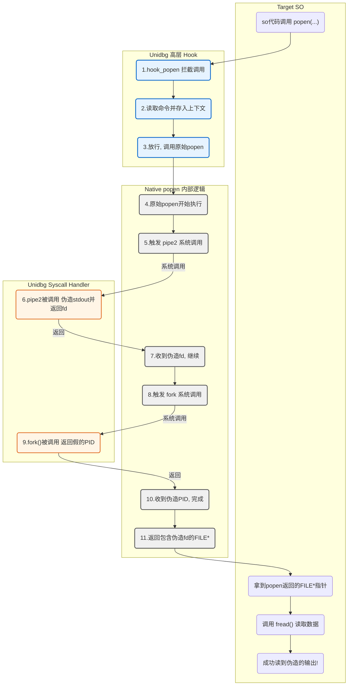

  
# 一、课程目标  
1. 掌握 Unidbg 中处理不同场景的系统调用（Syscall）Hook 策略  
2. 学习通过高层与底层 Hook 联动，模拟复杂的库函数（如 popen）  
3. 应用 Dobby 等工具对关键库函数（如 gettid）进行修补，以绕过环境检测  
# 二、工具  
  
1.教程 Demo  
2.IDEA  
3.IDA  
# 三、课程内容  
  
### 一. 补系统调用  
#### 1.补系统调用环境的核心概念  
系统调用（Syscall）补环境是 Unidbg 模拟执行中一个基础且高级的环节。当原生库（. So 文件）为了性能、对抗或功能需要，绕过标准库（libc）函数，通过 `SVC` 等底层指令直接向操作系统内核发起请求时，Unidbg 必须能够拦截并模拟这些内核级别的行为。由于 Unidbg 并非一个完整的操作系统，其对内核的模拟是不完备的。如果 so 文件请求了一个 Unidbg 未实现或模拟不完善的系统调用（通过系统调用号 `NR` 区分），通常会导致模拟流程出错、返回无效数据（如 `fstat` 对目录返回全零），或进入非预期的逻辑分支，最终使模拟失败或结果失真。因此，系统调用补环境的目的就是识别并接管这些对内核的底层请求，通过自定义 `SyscallHandler` 提供一个符合目标 so 逻辑预期的模拟行为或返回值，从而“欺骗”so 文件，使其相信自己正与一个真实的 Linux/Android 内核交互。  
  
#### 2.解读 unidbg 的警告日志  
当 unidbg 遇到一个它无法处理的软中断（SVC）时，通常会打印出如下格式的 `WARN` 日志：  
```powershell  
[00:46:49 186]  WARN [com.github.unidbg.linux.ARM64SyscallHandler] (ARM64SyscallHandler:399) - handleInterrupt intno=2, NR=165, svcNumber=0x0, PC=RX@0x401ba3d4[libc.so]0x6a3d4, LR=RX@0x40000770[libdemo.so]0x770, syscall=null  
```  
这个日志包含了定位问题的关键信息：  
  * **`handleInterrupt intno=2`**: `intno=2` 代表这是一个 `EXCP_SWI`（Software Interrupt），即软中断，通常由 `SVC` 指令触发，这是系统调用的入口。  
  * **`NR=165`**: 这是最重要的字段，**系统调用号 (Syscall Number)**。它唯一标识了是哪个系统调用。你需要根据 CPU 架构（ARM 32/ARM 64）去查找对应的系统调用表。例如，在 ARM 64 下，165 号系统调用是 `getrusage`。你可以访问[这个网站](https://chromium.googlesource.com/chromiumos/docs/+/master/constants/syscalls.md#arm64-64_bit)来查询。  
  * **`svcNumber=0x0`**: 这是 `SVC` 指令后的立即数。在 unidbg 的设计中，**约定 `svcNumber` 为 0 的才是真正的系统调用**。  
  * **`PC` 和 `LR`**: `PC` (Program Counter) 指示了当前执行到的地址，通常在 `libc.so` 内部。`LR` (Link Register) 指示了调用该系统调用的返回地址，通常在你的目标 `so` 中，这能帮你快速定位到是 so 中哪块代码触发了该系统调用。  
  * **`syscall=null`**: 如果 unidbg 对这个 `NR` 有部分认知，可能会在这里显示系统调用的名字，但大多数未实现的情况这里都是 `null`。  
`区分系统调用与 JNI 调用`  
一个常见的困惑点是，JNI 函数调用失败的日志和系统调用非常相似，因为 unidbg 在底层都使用了 `SVC` 指令作为跳板。  
**关键区分点在于 `svcNumber`**：  
  * **系统调用**: `svcNumber` **等于** `0x0`。  
  * **JNI 调用**: `svcNumber` **不等于** `0x0`，它是一个用于内部索引 JNI 函数的值。  
例如，一个 JNI 调用失败的日志可能如下，注意 `svcNumber=0x16f`：  
```powershell  
[01:00:43 681]  WARN [com.github.unidbg.linux.ARM64SyscallHandler] ... svcNumber=0x16f ...  
java.lang.UnsupportedOperationException: com/aliyun/TigerTally/A->ct()Landroid/content/Context;  
```  
并且，JNI 调用失败通常会紧跟着抛出 `UnsupportedOperationException`，并带有清晰的 JNI 方法签名。  
  
#### 3.核心方法论：自定义 `SyscallHandler`  
解决系统调用问题的通用范式是创建一个继承自 unidbg 原生 `SyscallHandler` 的子类，并重写或补充其中的方法。  
首先，你需要定义一个自己的 `SyscallHandler`。以 ARM 64 为例：  
```java  
import com.github.unidbg.Emulator;  
import com.github.unidbg.linux.ARM64SyscallHandler;  
import com.github.unidbg.memory.SvcMemory;  
// 继承自ARM64SyscallHandler，如果是32位则继承ARM32SyscallHandler  
public class MySyscallHandler extends ARM64SyscallHandler {  
    public MySyscallHandler(SvcMemory svcMemory) {  
        super(svcMemory);  
        setVerbose(true); // 可按需开启详细日志  
    }  
    // 在这里重写或添加你的处理逻辑  
}  
```  
然后，在构建 `Emulator` 时，通过 `AndroidEmulatorBuilder` 将其替换掉默认的处理器。  
```java  
import com.github.unidbg.AndroidEmulator;  
import com.github.unidbg.file.linux.AndroidFileIO;  
import com.github.unidbg.linux.android.AndroidARM64Emulator;  
import com.github.unidbg.linux.android.AndroidEmulatorBuilder;  
import com.github.unidbg.memory.SvcMemory;  
import com.github.unidbg.unix.UnixSyscallHandler;  
  
AndroidEmulatorBuilder builder = new AndroidEmulatorBuilder(true) {  
    @Override  
    public AndroidEmulator build() {  
        return new AndroidARM64Emulator(processName, rootDir, backendFactories) {  
            @Override  
            protected UnixSyscallHandler<AndroidFileIO> createSyscallHandler(SvcMemory svcMemory) {  
                return new MySyscallHandler(svcMemory);  
            }  
        };  
    }  
};  
builder.setProcessName("com.zj.wuaipojie");  
emulator = builder.build();  
```  
  
#### 4.场景一：系统调用未实现  
  
这是最常见的情况，unidbg 对某个 `NR` 完全没有实现，直接在 `handleInterrupt` 处抛出警告。  
**案例 1：`getcpu` (NR=168)**  
  
在我们的 `MySyscallHandler` 中，重写 `handleUnknownSyscall` 方法，捕获未被处理的 `NR`。  
```java  
// In MySyscallHandler.java  
import com.github.unidbg.Emulator;  
import com.github.unidbg.arm.backend.Backend;  
import com.github.unidbg.pointer.UnidbgPointer;  
import com.sun.jna.Pointer;  
import unicorn.Arm64Const;  
@Override  
protected boolean handleUnknownSyscall(Emulator<?> emulator, int NR) {  
    System.err.println(">>> MySyscallHandler is processing syscall NR = " + NR);  
    Backend backend = emulator.getBackend();  
    switch (NR) {  
  
        /** getcpu (NR=168): x0=cpu*, x1=node* */  
        case 168: {  
            Pointer cpuPtr = UnidbgPointer.register(emulator, Arm64Const.UC_ARM64_REG_X0);  
            Pointer nodePtr = UnidbgPointer.register(emulator, Arm64Const.UC_ARM64_REG_X1);  
  
            // C++ 代码会多次调用 getcpu，期望 cpu 号码会变化且不为0  
            // 我们用一个随机数来模拟 CPU 核心的切换  
            int currentCpu = rng.nextInt(8); // 模拟8核CPU  
            if (cpuPtr != null) {  
                cpuPtr.setInt(0, currentCpu);  
            }  
            if (nodePtr != null) {  
                // NUMA 节点通常为 0                nodePtr.setInt(0, 0);  
            }  
            // 成功返回 0            writeX(backend, Arm64Const.UC_ARM64_REG_X0, 0);  
            return true;  
        }  
  
    }  
    return super.handleUnknownSyscall(emulator, NR);  
}  
```  
  
**案例 2：`statx` (NR=291)**  
`statx` 是 Linux 中一个现代化的、用于**获取文件元数据（metadata）的系统调用**。它是 `stat`, `fstat`, `lstat` 的继任者和升级版。  
  
文件的元数据，就是描述文件属性的信息，例如：  
- 文件大小 (`size`)  
- 文件类型 (是普通文件、目录、还是链接？)  
- 权限 (`mode`, 例如 `rwx-r-x--x`)  
- 所有者 (UID, GID)  
- 时间戳 (访问时间 `atime`、修改时间 `mtime`、状态变更时间 `ctime`)  
  
**`statx` 相对于旧版 `stat` 的主要优势：**  
1.**更丰富的信息**：`statx` 可以获取旧版 `stat` 无法提供的信息，最典型的就是**文件的创建时间（birth time, `btime`）**。  
2.**更高精度的时间戳**：旧版 `stat` 的时间戳只精确到秒。而 `statx` 可以提供**纳秒（nanosecond）**级别的精度，这对于现代文件系统和应用至关重要。  
3.更高的效率和灵活性 (Mask 机制)**：调用旧版 `stat` 时，内核会把所有元数据一次性全返回给你，即使你只关心文件大小。`statx` 引入了一个 `mask`（掩码）参数，允许调用者明确告诉内核：“我只对文件大小和修改时间感兴趣”。内核就会只获取并返回这些信息，避免了不必要的工作，提高了效率  
4.**更好的扩展性**：它的结构体设计考虑了未来，留有备用字段，方便以后添加新的文件属性而不需要再次设计新的系统调用。  
`如何填充statx结构:`  
- **`statx` 在线手册**: [https://man7.org/linux/man-pages/man2/statx.2.html](https://man7.org/linux/man-pages/man2/statx.2.html)  
打开页面后，您会找到 `struct statx` 的 C 语言定义，它长这样：  
```C  
struct statx {  
    __u32 stx_mask;        /* Mask of fields returned */  
    __u32 stx_blksize;     /* Block size for filesystem I/O */  
    __u64 stx_attributes;  /* Extra file attribute hints */  
    __u32 stx_nlink;       /* Number of hard links */  
    __u32 stx_uid;         /* User ID of owner */  
    __u32 stx_gid;         /* Group ID of owner */  
    __u16 stx_mode;        /* File type and mode */  
    __u16 __spare0[1];  
    __u64 stx_ino;         /* Inode number */  
    __u64 stx_size;        /* Total size in bytes */  
    __u64 stx_blocks;      /* Number of 512B blocks allocated */  
    __u64 stx_attributes_mask;  
    /* The following fields are copied from struct statx_timestamp */  
    struct statx_timestamp stx_atime; /* Last access */  
    struct statx_timestamp stx_btime; /* Creation */  
    struct statx_timestamp stx_ctime; /* Last status change */  
    struct statx_timestamp stx_mtime; /* Last modification */  
    /* If this structure is extended, then constants described in  
       statx(2) will be defined to describe the new fields. */  
};  
  
struct statx_timestamp {  
    __s64 tv_sec;  
    __u32 tv_nsec;  
    __s32 __spare;  
};  
```  
接下来就是把上面的结构发给 AI 来伪造  
```java  
/** statx (NR=291): x1=path, x4=statx* */  
case 291: {  
	// 1. 获取参数：路径指针和用于接收结果的 statx 结构体指针  
	Pointer pathPtr = UnidbgPointer.register(emulator, Arm64Const.UC_ARM64_REG_X1);  
	Pointer stx = UnidbgPointer.register(emulator, Arm64Const.UC_ARM64_REG_X4);  
	String path = pathPtr != null ? pathPtr.getString(0) : null;  
  
	if (stx != null) {  
		// 2. 核心技巧：使用ByteBuffer来构建内存中的结构体  
		//    分配足够空间，并务必设置为LITTLE_ENDIAN（小端序），匹配ARM架构  
		ByteBuffer bb = ByteBuffer.allocate(0x100).order(ByteOrder.LITTLE_ENDIAN);  
  
		// 3. 按照 statx 结构体的定义，依次填充字段  
		//    具体填充什么值，取决于目标so关心哪些字段。通常给一些非零的、看起来合理的值即可。  
		bb.putInt(0x000007ff);  // stx_mask: STATX_ALL  
		bb.putInt(4096);        // stx_blksize  
		bb.putLong(0);          // stx_attributes  
		bb.putInt(1);           // stx_nlink (链接数)  
		bb.putInt(1000);        // stx_uid (user id)  
		bb.putInt(1000);        // stx_gid (group id)  
  
		// 根据路径判断是目录还是文件，并设置对应的模式  
		int S_IFDIR = 0x4000, S_IFREG = 0x8000;  
		int mode = (path != null && path.endsWith("/")) ? (S_IFDIR | 0755) : (S_IFREG | 0644);  
		bb.putShort((short) mode); // stx_mode  
  
		while (bb.position() < 0x20) bb.put((byte) 0); // 填充对齐  
  
		bb.putLong(123456789L); // stx_ino (inode number)  
		bb.putLong(4096L);      // stx_size (文件大小)  
		bb.putLong(8L);         // stx_blocks (块数量)  
  
		while (bb.position() < 0x58) bb.put((byte) 0); // 填充对齐  
  
		// 填充时间戳 (statx_timestamp 结构体)  
		long now = 1710000000L; // 给一个固定的未来时间戳  
		putStatxTs(bb, now); // atime (access time)  
		putStatxTs(bb, now); // btime (birth time)  
		putStatxTs(bb, now); // ctime (change time)  
		putStatxTs(bb, now); // mtime (modify time)  
  
		// 4. 将构建好的ByteBuffer内容，写入到so传入的指针地址  
		stx.write(0, bb.array(), 0, bb.limit());  
	}  
	// 5. 设置返回值为0，表示成功  
	writeX(backend, Arm64Const.UC_ARM64_REG_X0, 0);  
	return true;  
}  
  
```  
#### 5.场景二：系统调用模拟不完善或过于简单  
Unidbg 实现了该系统调用，但存在缺陷。  
  
**案例 1：`clock_gettime` (NR=113, ARM 64)**  
`clock_gettime(clockid_t clk_id, struct timespec *tp)` 用于获取特定时钟的时间。Unidbg 实现了对 `CLOCK_REALTIME (clk_id=0)` 的处理，但没有实现 `CLOCK_PROCESS_CPUTIME_ID (clk_id=2)`，导致传入 2 时抛出异常。  
**解决方案**：重写 `clock_gettime` 方法。  
```java  
@Override  
protected int clock_gettime(Emulator<?> emulator) {  
    Backend backend = emulator.getBackend();  
  
    long clkId = readX(backend, Arm64Const.UC_ARM64_REG_X0); // x0 = clk_id  
    Pointer tp = UnidbgPointer.register(emulator, Arm64Const.UC_ARM64_REG_X1); // x1 = timespec*  
    if (tp == null) {  
        // 按 Linux 约定：失败返回 -errno；这里给个通用 EFAULT  
        return -14; // -EFAULT  
    }  
    // 构造各类时钟的返回值（64-bit timespec: tv_sec(8) + tv_nsec(8)）  
    long nowMs = System.currentTimeMillis();  
    long nowNs = System.nanoTime();  
  
    long sec, nsec;  
    switch ((int) clkId) {  
        case 0: // CLOCK_REALTIME  
        case 8: // CLOCK_REALTIME_ALARM  
            sec  = nowMs / 1000L;  
            nsec = (nowMs % 1000L) * 1_000_000L;  
            break;  
        case 1: // CLOCK_MONOTONIC  
        case 4: // CLOCK_MONOTONIC_RAW（有的系统是 4）  
        case 7: // CLOCK_BOOTTIME  
        case 9: // CLOCK_BOOTTIME_ALARM  
            sec  = nowNs / 1_000_000_000L;  
            nsec = nowNs % 1_000_000_000L;  
            break;  
        case 2: // CLOCK_PROCESS_CPUTIME_ID  
        case 3: // CLOCK_THREAD_CPUTIME_ID  
            // 进程/线程 CPU 时间：给一个非零的、单调增长的“小值”即可  
            // 这里简单用 nanoTime 的低位模拟  
            sec = 0L;  
            nsec = (nowNs % 50_000_000L) + 10_000L; // ~0~50ms，避免全 0            break;  
        default:  
            // 未识别的 id：退化成 REALTIME，避免抛异常  
            sec = nowMs / 1000L;  
            nsec = (nowMs % 1000L) * 1_000_000L;  
            break;  
    }  
  
    tp.setLong(0, sec);  
    tp.setLong(8, nsec);  
    return 0; // 成功  
}  
```  
  
**案例 2: `sched_getaffinity` (NR=123)**  
  
有时候，我们会发现某个系统调用的实现在 Unidbg 的父类 `ARM64SyscallHandler` 中，但该实现方法被声明为 `final`，导致我们无法像 `clock_gettime` 那样直接 `@Override` 它。此外，有些系统调用是在一个巨大的 `switch` 语句（如 `handleSyscall` 方法）中处理的，我们只想修改其中一个 `case` 的行为，同样无法直接重写。  
  
在这种情况下，我们需要在更早的阶段介入。系统调用的最顶层入口是 `hook()` 方法，它负责接收所有 `SVC` 中断，解析出系统调用号（NR），然后再分发给具体的处理方法。通过重写 `hook()`，我们可以在 Unidbg 分发之前“截胡”我们关心的系统调用，实现自定义逻辑。  
  
`sched_getaffinity` 用于检测当前进程可以运行在哪些 CPU 核心上，这常被用于环境检测或设备指纹生成。  
**解决方案：** 在 `hook()` 方法中，抢先处理目标 `NR`，然后“屏蔽”它，避免父类重复执行。  
```java  
@Override  
public void hook(Backend backend, int intno, int swi, Object user) {  
    // 1. 在顶层入口，首先读取X8寄存器，拿到系统调用号 NR  
    int nr = ((Number) backend.reg_read(Arm64Const.UC_ARM64_REG_X8)).intValue();  
  
    // 2. 判断是否是我们想“截胡”的系统调用  
    if (nr == 123) { // __NR_sched_getaffinity (arm64)  
        // 读取参数：X1 = cpusetsize, X2 = mask 地址  
        long cpusetsize = ((Number) backend.reg_read(Arm64Const.UC_ARM64_REG_X1)).longValue();  
        long maskAddr    = ((Number) backend.reg_read(Arm64Const.UC_ARM64_REG_X2)).longValue();  
  
        // 3. 实现自定义的模拟逻辑  
        if (maskAddr != 0 && cpusetsize > 0) {  
            final int cores = 8;                      // 模拟一个8核CPU  
            final int size  = (int) cpusetsize;  
            byte[] buf = new byte[size];              // 初始化为全0的字节数组  
            int maxBits   = size * 8;  
            int bitsToSet = Math.min(cores, maxBits); // 计算需要设置的位数  
            // 构造CPU亲和度的bitmask (例如8核，就把低8位置为1)  
            for (int cpu = 0; cpu < bitsToSet; cpu++) {  
                int bi = cpu / 8;  
                int bit = cpu % 8;  
                buf[bi] |= (1 << bit);  
            }  
            backend.mem_write(maskAddr, buf); // 将结果写入到指针指向的内存  
        }  
  
        // 4. 设置返回值到 X0 寄存器  
        backend.reg_write(Arm64Const.UC_ARM64_REG_X0, cpusetsize);  
  
        // 5. 【关键步骤】将X8寄存器设置为一个无效的系统调用号  
        //    这是为了防止接下来调用的 super.hook() 再次处理 NR=123，从而覆盖掉我们的结果。  
        backend.reg_write(Arm64Const.UC_ARM64_REG_X8, -1);  
    }  
  
    // 6. 【必须调用】调用父类的hook方法，以确保PC指针能正确推进，  
    //    并且其他不被我们处理的系统调用能够正常执行。否则模拟会卡死。  
    super.hook(backend, intno, swi, user);  
}  
```  
  
**案例 3：`fstat` (NR=80)**  
  
`fstat` 和 `statx` 的核心目标都是获取文件元数据，但它们在设计、功能和使用方式上存在显著差异。简单来说，**`statx` 是 `fstat` 的现代、功能更全面的“超级升级版”**。  
  
|特性 / 方面| `fstat` (旧版)| `statx` (现代版)|  
|---|---|---|  
|**操作对象**|**只能**作用于一个已经打开的**文件描述符 (fd)**。|**更灵活**，既可以作用于**文件描述符**，也可以直接作用于**文件路径**。|  
|**信息丰富度**|返回 `struct stat` 结构体，信息相对基础。|返回 `struct statx` 结构体，信息更丰富，可以提供**文件创建时间 (btime)** 等。|  
|**时间戳精度**|传统上只精确到**秒**。|精确到**纳秒 (nanosecond)**，更能满足现代高精度需求。|  
|**执行效率**|**All-or-Nothing (全量获取)**。每次调用，内核都会填充所有字段，不管你是否需要。|**On-Demand (按需获取)**。可以通过 `mask` 参数精确指定需要哪些信息，内核按需返回，效率更高。|  
|**扩展性**| `struct stat` 结构体已非常拥挤，难以扩展。| `struct statx` 设计上留有余地，方便未来添加新属性。|  
  
```java  
// 在 unidbg 源码 unidbg-android\src\main\java\com\github\unidbg\linux\file\DirectoryFileIO.java有相关实现  
@Override  
public int fstat(Emulator<?> emulator, StatStructure stat) {  
    stat.st_mode = IO.S_IFDIR;  
    stat.st_dev = 0;  
    stat.st_size = 0;  
    stat.st_blksize = 0;  
    stat.st_ino = 0;  
    stat.pack();  
    return 0;  
}  
```  
  
对照着实现，并伪造一些模拟数据  
```java  
if (nr == 80) { // __NR_fstat (arm64)  
    // 1. 获取参数：fd在x0, stat结构体指针在x1  
    int fd = ((Number) backend.reg_read(Arm64Const.UC_ARM64_REG_X0)).intValue();  
    UnidbgPointer statbuf = UnidbgPointer.register(emulator, Arm64Const.UC_ARM64_REG_X1);  
  
    // 2. 判断这个fd是否是我们关心的目录类型  
    if (this.fdMap.get(fd) instanceof DirectoryFileIO) {  
        System.out.println("Hooked fstat(80) for directory fd=" + fd);  
  
        // 3. 使用Unidbg的StatStructure帮助类来填充数据  
        // 这比自己算偏移量和手动写ByteBuffer要简单得多  
        StatStructure stat = new Stat64(statbuf);  
  
        // 4. 伪造数据  
        stat.st_mode = S_IFDIR | 0755; // 模式：目录 + 权限  
        stat.st_dev = 1;  
        stat.st_size = 4096;  
        stat.st_blksize = 4096;  
        stat.st_ino = 12345;  
        stat.setSt_atim(1668267277L, 999999999L);  
  
  
        // 5. 调用pack()将以上设置好的字段，按照内存布局写入指针  
        stat.pack();  
  
        // 6. 设置返回值为0(成功)，并屏蔽父类逻辑  
        backend.reg_write(Arm64Const.UC_ARM64_REG_X0, 0);  
        backend.reg_write(Arm64Const.UC_ARM64_REG_X8, -1);  
    }  
```  
#### 6.场景三：处理依赖复杂系统调用链的库函数  
有些库函数（如 `popen`）的实现依赖一整套复杂的系统调用（`vfork`, `pipe2`, `dup2` / `dup3`, `execve`, `wait4` 等），这些都和进程创建、IPC（进程间通信）相关，是 unidbg 的弱项。尝试逐个修复这些系统调用会陷入泥潭。  
因此，我们采用一种更高级、更高效的“组合拳”策略：**在高层 Hook 函数意图，在底层伪造结果**。  
  
**案例：修复 `popen`**  
`popen` 函数会执行一个 shell 命令，并创建一个管道，返回一个文件流指针，后续代码可以通过 `fread` 等函数从这个文件流中读取命令的输出结果。  

**第一步：使用 xHook 拦截 `popen` 调用意图  
  
使用 unidbg 的 Hook 功能（如 `xhook`），通过 xHook 拦截对 `popen` 的调用，主要目的不是替换它，而是**获取它将要执行的命令字符串**，并将其存入 Unidbg 的上下文中，供后续的底层 SyscallHandler 使用。  
  
```java  
private void hook_popen() {  
    IxHook xHook = XHookImpl.getInstance(emulator);  
    // 监控目标so对popen的调用  
    xHook.register("libszstone.so", "popen", new ReplaceCallback() {  
        @Override  
        public HookStatus onCall(Emulator<?> emulator, HookContext context, long originFunction) {  
            RegisterContext registerContext = emulator.getContext();  
            String command = registerContext.getPointerArg(0).getString(0);  
            // 将捕获到的命令存入上下文，键为 "command"  
            emulator.set("command", command);  
            System.out.println("command:"+command);  
            // 让原始的 popen 函数继续执行，我们只“偷听”，不干扰  
            return HookStatus.RET(emulator, originFunction);  
        }  
    }, true);  
    // 使其生效  
    xHook.refresh();  
}  
// 在调用目标函数前，先执行 hook_popen ();  
challenge.hook_popen();  
```  
**第二步：在 `SyscallHandler` 中伪造关键系统调用的结果**  
当原始的 `popen` 函数执行时，它会触发一系列系统调用。我们不需要全部实现它们，只需要伪造其中最关键的几个，形成一个逻辑闭环即可。  
**1. 伪造 `pipe2` (NR=59) - 创建通信管道**  
`popen` 首先会调用 `pipe2` 来创建一个管道，这个管道包含一个“读”端和一个“写”端。这是我们注入伪造结果的最佳时机。  
```java  
@Override  
protected int pipe2(Emulator<?> emulator) {  
    // AArch64下，第一个参数通过 X0 寄存器传递，这里是指向 int pipefd[2] 的指针  
    UnidbgPointer pipefd = UnidbgPointer.register(emulator, Arm64Const.UC_ARM64_REG_X0);  
  
    // 分配两个新的文件描述符(fd)  
    int write_fd = getMinFd();  
    int read_fd = getMinFd();  
  
    this.fdMap.put(write_fd, new DumpFileIO(write_fd));  
  
    // 从上下文中取出刚才hook_popen时存入的命令  
    String cmd = (String) emulator.get("command");  
    if (cmd == null) cmd = "stat /data"; // 兜底  
  
    // 【核心】根据命令，准备好要伪造的输出内容  
    String stdout = "\n";  
    if ("stat /data".equals(cmd)) {  
        stdout =  
            "  File: /data\n" +  
                    "  Size: 4096     Blocks: 16      IO Blocks: 512 directory\n" +  
                    "Device: 10305h/66309d    Inode: 2        Links: 53\n" +  
                    "Access: (0771/drwxrwx--x)       Uid: ( 1000/  system)   Gid: ( 1000/  system)\n" +  
                    "Access: 2022-04-22 16:08:42.656423789 +0800\n" +  
                    "Modify: 1970-02-05 00:02:38.459999996 +0800\n" +  
                    "Change: 1971-12-21 21:33:28.769999994 +0800\n";  
    }  
  
    // 将伪造的输出内容包装成一个ByteArrayFileIO，并与“读”端fd关联  
    this.fdMap.put(read_fd, new ByteArrayFileIO(0, "pipe2_read_side", stdout.getBytes()));  
  
    // 【关键细节】将两个fd写回so传入的指针地址。  
    // 即使在64位系统，pipefd参数也是一个 int[2] 数组，每个int占4字节。  
    pipefd.setInt(0, read_fd);   // 写入读端fd  
    pipefd.setInt(4, write_fd);  // 写入写端fd  
  
    // Unidbg会自动将此方法的返回值(0)写入X0寄存器，表示调用成功  
    return 0;  
}  
```  
**2. 伪造 `fork` - 创建子进程**  
  
`popen` 接着会调用 `fork` 来创建子进程。在 Unidbg 中，我们无需真的创建一个进程。`fork` 系统调用的特点是：在父进程中返回子进程的 PID（一个正整数），在子进程中返回 0。由于 `popen` 的后续流程在父进程中，我们只需要**让它以为子进程创建成功了**即可。  
  
```java  
// In MySyscallHandler.java  
private int fakePid = 4242; // 维护一个假的PID  
  
@Override  
protected long fork(Emulator<?> emulator) {  
    // 直接返回一个递增的、非零的假PID  
    // 这会让调用fork的父进程逻辑认为子进程已成功创建  
    return ++fakePid;  
}  
```  
通过以上组合拳，`popen` 的执行流程被我们完美地“欺骗”了：  
1.它调用 `pipe2`，得到了两个文件描述符。  
2.它调用 `fork`，得到了一个看似成功的子进程 PID。  
3.接下来，父进程会关闭管道的写端，然后从读端 `read_fd` 读取数据。  
4.当它读取 `read_fd` 时，实际上读取的是我们预设在 `ByteArrayFileIO` 中的 `stdout` 字符串。  
最终，so 获取到了我们想让它获取的任何结果，而我们完全没有涉及复杂的多进程模拟。  
  
### 二. 补库函数  
  
  
**案例 2：补 gettid**  
**`gettid` 函数详解**  
在 Linux 内核中，每个线程都有一个唯一的标识符，即线程 ID（TID）。`gettid` 函数是应用程序获取这个底层 ID 最直接的方式。  
**1. 它是做什么的？**  
`gettid` 是一个 Linux 特有的 C 函数，原型如下：  
```C  
#include <sys/types.h>  
pid_t gettid(void);  
```  
- **功能**：函数不接受任何参数，直接返回调用它的那个**线程**的 ID（TID）。  
- **返回值**：  
    - 返回一个 `pid_t` 类型（通常是 `int`）的线程ID。  
    - 在 Linux 中有一个非常重要的特性：对于一个进程的**主线程**，其 TID 总是与该进程的 PID（Process ID）**相等**。  
- **Java 层对应**：当一个 App 的 Java 代码调用 `android.os.Process.myTid()` 时，其底层最终就会调用到这个 Native 函数。  
  
**2. 为什么它在补环境中如此重要？**  
`gettid` 是风控和反调试检测的“常客”，因为它能揭示程序运行的线程环境，而 Unidbg 的线程模型与真实设备有本质区别。检测点通常包括：  
- **主线程检测**：程序会同时调用 `getpid()` 和 `gettid()`，如果发现两者返回值不相等，就可以断定当前代码运行在一个子线程中。某些核心初始化或安全校验逻辑会强制要求必须在主线程执行。  
- **环境一致性**：在 Unidbg 的单线程模拟下，`gettid()` 的返回值可能是一个固定的、不符合真实内核分配规律的值。检测逻辑可以通过多次调用 `gettid()`，或者将其与 `getpid()` 比较，来识破模拟环境。  
- **线程识别**：某些 so 会使用 TID 作为日志、加解密或内部数据结构的唯一标识。一个错误的 TID 可能导致程序逻辑错乱或崩溃。  
  
如果不修补 `gettid`，Unidbg 环境下的返回值很可能无法通过上述校验，导致 so 认为自己运行在异常线程或模拟器中，从而改变执行路径或直接退出。  
  
**3. 修补方法**  
对于 `gettid`，最直接有效的修补方式就是使用 Dobby 进行 Inline Hook，强制它返回一个我们期望的值。通常，我们会让它返回当前的进程 ID（PID），以完美模拟“主线程”的行为。  
```java  
// 修补方法：使用Dobby直接Hook原生C函数  
private static void hookLibcGettidWithDobby(Emulator<?> emulator, int forcedTid) {  
    // 第1步：定位gettid函数所在的模块 libc.so  
    Module libc = emulator.getMemory().findModule("libc.so");  
    if (libc == null) {  
        throw new IllegalStateException("libc.so not found");  
    }  
  
    // 第2步：在模块中查找函数符号(Symbol)，即函数的地址  
    // 注意：不同Android版本，函数名可能是 gettid 或 __gettid  
    Symbol sym = libc.findSymbolByName("gettid", false);  
    if (sym == null) sym = libc.findSymbolByName("__gettid", false);  
    if (sym == null) {  
        throw new IllegalStateException("gettid/__gettid symbol not found in libc.so");  
    }  
  
    // 第3步：获取Dobby实例，并调用 replace 方法执行Hook  
    Dobby dobby = Dobby.getInstance(emulator);  
    dobby.replace(sym, new ReplaceCallback() {  
        @Override  
        public HookStatus onCall(Emulator<?> emulator, HookContext context, long originFunction) {  
            // C函数原型: pid_t gettid(void);  
            // 函数无参数，我们直接伪造返回值即可。  
  
            // forcedTid 可以是 emulator.getPid() 或任何你期望的值  
            int fakeTid = forcedTid;  
            System.out.println("[HOOK] gettid(): Faking return value to -> " + fakeTid);  
  
            // 【核心】使用HookStatus.LR()直接返回，不再执行原始函数。  
            // AArch64架构下，函数返回值在X0寄存器。  
            // Dobby会将 fakeTid 写入X0寄存器，并立即返回到调用者。  
            return HookStatus.LR(emulator, (long) (fakeTid & 0xffffffffL));  
        }  
    });  
}  
  
// 在主流程中调用:  
// 通常我们会让TID等于PID来模拟主线程  
hookLibcGettidWithDobby(emulator, emulator.getPid());  
```  
  
`小结:`  
深入探讨了 Unidbg 中三种高级 Hook 技术以应对复杂的模拟挑战。首先，介绍了针对不同场景（如 final 方法）的系统调用 Hook 策略，通过重写顶层 hook() 方法实现精准拦截。演示了通过高层函数 Hook（xHook popen）与底层 Syscall 伪造（pipe2, fork）相结合的“组合拳”策略，高效模拟复杂调用链。最后，展示了如何应用 Dobby 直接修补 C 库函数（gettid）以绕过环境一致性检测。  
  
`完整代码:`  
**ChallengeTenThree:**  
```java  
package com.zj.wuaipojie.util;  
  
import com.github.unidbg.AndroidEmulator;  
import com.github.unidbg.Emulator;  
import com.github.unidbg.Module;  
import com.github.unidbg.Symbol;  
import com.github.unidbg.arm.HookStatus;  
import com.github.unidbg.arm.context.RegisterContext;  
import com.github.unidbg.file.FileResult;  
import com.github.unidbg.file.IOResolver;  
import com.github.unidbg.file.linux.AndroidFileIO;  
import com.github.unidbg.hook.HookContext;  
import com.github.unidbg.hook.ReplaceCallback;  
import com.github.unidbg.hook.hookzz.Dobby;  
import com.github.unidbg.hook.xhook.IxHook;  
import com.github.unidbg.linux.android.AndroidARM64Emulator;  
import com.github.unidbg.linux.android.AndroidEmulatorBuilder;  
import com.github.unidbg.linux.android.AndroidResolver;  
import com.github.unidbg.linux.android.XHookImpl;  
import com.github.unidbg.linux.android.dvm.*;  
import com.github.unidbg.linux.file.ByteArrayFileIO;  
import com.github.unidbg.memory.Memory;  
import java.io.File;  
import java.io.FileNotFoundException;  
import java.nio.charset.StandardCharsets;  
import com.github.unidbg.linux.android.dvm.DvmClass;  
import com.github.unidbg.memory.SvcMemory;  
import com.github.unidbg.unix.UnixSyscallHandler;  
  
  
  
  
public class ChallengeTenThree extends AbstractJni implements IOResolver<AndroidFileIO>{  
  
    private final AndroidEmulator emulator;  
    private final VM vm;  
    private final Module module;  
    private static final String PACKAGE_NAME = "com.zj.wuaipojie";  
    private static final String APK_PATH = "/data/app/com.zj.wuaipojie-1/base.apk";  
    public ChallengeTenThree() {  
        AndroidEmulatorBuilder builder = new AndroidEmulatorBuilder(true) {  
            @Override  
            public AndroidEmulator build() {  
                return new AndroidARM64Emulator(processName, rootDir, backendFactories) {  
                    @Override  
                    protected UnixSyscallHandler<AndroidFileIO> createSyscallHandler(SvcMemory svcMemory) {  
                        return new MySyscallHandler(svcMemory);  
                    }  
                };  
            }  
        };  
        builder.setProcessName("com.zj.wuaipojie");  
        emulator = builder.build();  
        emulator.getSyscallHandler().setVerbose(true);  
        emulator.getSyscallHandler().addIOResolver(this);  
        final Memory memory = emulator.getMemory();  
        memory.setLibraryResolver(new AndroidResolver(23));  
        vm = emulator.createDalvikVM();  
        vm.setJni(this);  
        //vm.setVerbose(true);  
  
        File soFile = new File("unidbg-android/src/test/java/com/zj/wuaipojie/util/lib52pojie.so");  
        DalvikModule dm = vm.loadLibrary(soFile, true);  
        module = dm.getModule();  
        hookLibcGettidWithDobby(emulator, 0xFFFF);  
        dm.callJNI_OnLoad(emulator);  
    }  
  
  
    public void callUnidbgLevel3(int javaTid) {  
        System.out.println("====== 开始执行 unidbg_level3 函数 ======");  
        // 【新增】将 javaTid 存入上下文，供 MySyscallHandler 中的 gettid 使用  
        emulator.set("javaTid", javaTid);  
  
        DvmClass securityUtilClass = vm.resolveClass("com/zj/wuaipojie/util/SecurityUtil");  
        StringObject result = securityUtilClass.callStaticJniMethodObject(emulator,  
                "unidbg_level3(I)Ljava/lang/String;", javaTid  
        );  
        System.out.println("====== 函数执行完毕 ======");  
        System.out.println("JNI 函数返回结果: " + result);  
  
    }  
  
    public static void main(String[] args) throws FileNotFoundException {  
        ChallengeTenThree challenge = new ChallengeTenThree();  
        challenge.hook_popen();  
        challenge.hook_libc_open();  
        challenge.callUnidbgLevel3(0xFFFF);  
    }  
  
    //替换该open函数。当它从反模拟检查中检测到特定路径时，它将返回 -1    private void hook_libc_open() {  
        Module libc = emulator.getMemory().findModule("libc.so");  
        Symbol openSymbol = libc.findSymbolByName("open", false);  
        if (openSymbol == null) {  
            throw new IllegalStateException("Failed to find 'open' symbol in libc.so");  
        }  
  
        Dobby dobby = Dobby.getInstance(emulator);  
        dobby.replace(openSymbol, new ReplaceCallback() {  
            @Override  
            public HookStatus onCall(Emulator<?> emulator, HookContext context, long originFunction) {  
                RegisterContext r = emulator.getContext();  
                String pathname = r.getPointerArg(0).getString(0);  
  
                if ("/proc/self/anti_syscall_test".equals(pathname)) {  
                    System.out.println("[HOOK] Intercepted open(\"/proc/self/anti_syscall_test\"). Returning -1 to defeat writability check.");  
                    return HookStatus.LR(emulator, -1L);  
                }  
                return HookStatus.RET(emulator, originFunction);  
            }  
        });  
    }  
  
    private static void hookLibcGettidWithDobby(Emulator<?> emulator, int forcedTid) {  
        // 1) 定位 libc.so        Module libc = emulator.getMemory().findModule("libc.so");  
        if (libc == null) {  
            throw new IllegalStateException("libc.so not found");  
        }  
  
        // 2) 查找符号：不同 bionic 版本可能是 gettid 或 __gettid        Symbol sym = libc.findSymbolByName("gettid", false);  
        if (sym == null) sym = libc.findSymbolByName("__gettid", false);  
        if (sym == null) {  
            throw new IllegalStateException("gettid/__gettid symbol not found in libc.so");  
        }  
  
        // 3) Dobby inline hook：直接改返回值  
        Dobby dobby = Dobby.getInstance(emulator);  
        final int retTid = forcedTid; // 例如 Java 侧的 Process.myTid() 或 0xFFFF  
        dobby.replace(sym, new ReplaceCallback() {  
            @Override  
            public HookStatus onCall(Emulator<?> emulator, HookContext context, long originFunction) {  
                // AArch64 返回寄存器 X0 → 直接用 HookStatus.LR 设定函数返回值并“返回到调用者”  
                return HookStatus.LR(emulator, (long) (retTid & 0xffffffffL));  
            }  
        });  
    }  
  
    private void hook_popen() {  
        IxHook xHook = XHookImpl.getInstance(emulator);  
        xHook.register("libszstone.so", "popen", new ReplaceCallback() {  
            @Override  
            public HookStatus onCall(Emulator<?> emulator, HookContext context, long originFunction) {  
                RegisterContext registerContext = emulator.getContext();  
                String command = registerContext.getPointerArg(0).getString(0);  
                emulator.set("command", command);  
                System.out.println("command:"+command);  
                return HookStatus.RET(emulator, originFunction);  
            }  
        }, true);  
        // 使其生效  
        xHook.refresh();  
    }  
  
    @Override  
    public FileResult<AndroidFileIO> resolve(Emulator<AndroidFileIO> emulator, String pathname, int oflags) {  
        // 观察访问路径  
        System.out.println("[IOResolver] Intercepted file access -> Path: '" + pathname + "', Flags: 0x" + Integer.toHexString(oflags));  
  
  
        // ========= 2) 只读挂载需要的 /proc 文件 =========        switch (pathname) {  
  
            // 关卡9(1): /proc/self/status 必须非空，且 TracerPid: 0            case "/proc/self/status": {  
                String statusContent =  
                        "Name:\t" + PACKAGE_NAME + "\n" +  
                                "State:\tS (sleeping)\n" +  
                                "Tgid:\t12345\n" +  
                                "Pid:\t12345\n" +  
                                "PPid:\t1\n" +  
                                "Uid:\t1000\t1000\t1000\t1000\n" +  
                                "Gid:\t1000\t1000\t1000\t1000\n" +  
                                "TracerPid:\t0\n";  
                return FileResult.success(new ByteArrayFileIO(oflags, pathname,  
                        statusContent.getBytes(StandardCharsets.UTF_8)));  
            }  
  
            // 关卡9(2): /proc/cpuinfo 必须非空  
            case "/proc/cpuinfo": {  
                String cpuinfo =  
                        "Processor\t: ARMv8 Processor rev 1 (v8l)\n" +  
                                "BogoMIPS\t: 38.40\n" +  
                                "Features\t: fp asimd evtstrm aes pmull sha1 sha2 crc32\n" +  
                                "CPU implementer\t: 0x41\n" +  
                                "CPU architecture\t: 8\n" +  
                                "CPU variant\t: 0x0\n" +  
                                "CPU part\t: 0xd03\n" +  
                                "CPU revision\t: 1\n";  
                return FileResult.success(new ByteArrayFileIO(oflags, pathname,  
                        cpuinfo.getBytes(StandardCharsets.UTF_8)));  
            }  
  
            // 关卡9(3): /proc/self/maps 非空，且最好包含 libc.so（更稳）  
            case "/proc/self/maps": {  
                String mapsContent =  
                        "12000000-12100000 r-xp 00000000 00:00 0 /system/lib64/libc.so\n" +  // 关键：含 libc.so                                "70000000-7001f000 r-xp 00000000 00:00 0 /system/lib64/libart.so\n" +  
                                "7fbe852000-7fbe853000 r--p 00000000 00:00 0 " + APK_PATH + "\n";  
                return FileResult.success(new ByteArrayFileIO(oflags, pathname,  
                        mapsContent.getBytes(StandardCharsets.UTF_8)));  
            }  
  
        }  
        // 其他交给默认逻辑  
        return null;  
    }  
}  
```  
  
**MySyscallHandler:**  
```java  
package com.zj.wuaipojie.util;  
  
import com.github.unidbg.Emulator;  
import com.github.unidbg.arm.backend.Backend;  
import com.github.unidbg.file.linux.AndroidFileIO;  
import com.github.unidbg.file.linux.StatStructure;  
import com.github.unidbg.linux.ARM64SyscallHandler;  
import com.github.unidbg.linux.file.ByteArrayFileIO;  
import com.github.unidbg.linux.file.DirectoryFileIO;  
import com.github.unidbg.linux.file.DumpFileIO;  
import com.github.unidbg.linux.struct.Stat64;  
import com.github.unidbg.memory.SvcMemory;  
import com.github.unidbg.pointer.UnidbgPointer;  
import com.github.unidbg.unix.UnixEmulator;  
import com.sun.jna.Pointer;  
import unicorn.Arm64Const;  
import java.nio.ByteBuffer;  
import java.nio.ByteOrder;  
import java.util.Random;  
  
import static com.github.unidbg.unix.IO.S_IFDIR;  
  
  
public class MySyscallHandler extends ARM64SyscallHandler {  
  
    private final Random rng = new Random();  
  
    public MySyscallHandler(SvcMemory svcMemory) {  
        super(svcMemory);  
        setVerbose(true); // 可按需开启详细日志  
    }  
  
    /** 辅助：读/写寄存器 */  
    private static long readX(Backend backend, int reg) {  
        Number n = (Number) backend.reg_read(reg);  
        return n.longValue();  
    }  
    private static void writeX(Backend backend, int reg, long value) {  
        backend.reg_write(reg, value);  
    }  
  
    @Override  
    public void hook(Backend backend, int intno, int swi, Object user) {  
        // 模拟器实例是解决此问题的关键  
        Emulator<?> emulator = (Emulator<?>) user;  
        int nr = ((Number) backend.reg_read(Arm64Const.UC_ARM64_REG_X8)).intValue();  
        if (nr == 123) { // __NR_sched_getaffinity (arm64)  
            long cpusetsize = ((Number) backend.reg_read(Arm64Const.UC_ARM64_REG_X1)).longValue();  
            long maskAddr    = ((Number) backend.reg_read(Arm64Const.UC_ARM64_REG_X2)).longValue();  
  
            if (maskAddr != 0 && cpusetsize > 0) {  
                final int cores = 8;                      // 模拟 8 核  
                final int size  = (int) cpusetsize;  
                byte[] buf = new byte[size];              // 先全 0                int maxBits   = size * 8;  
                int bitsToSet = Math.min(cores, maxBits);  
                for (int cpu = 0; cpu < bitsToSet; cpu++) {  
                    int bi = cpu / 8;  
                    int bit = cpu % 8;                    // 低位到高位  
                    buf[bi] |= (1 << bit);  
                }  
                backend.mem_write(maskAddr, buf);  
            }  
  
            // 约定：返回写入的字节数（你之前的逻辑也是这样）  
            backend.reg_write(Arm64Const.UC_ARM64_REG_X0, (long) (cpusetsize & 0xffffffffL));  
  
            // 关键：把 X8 置为无效号，避免父类再按 123 处理覆盖你写的结果  
            backend.reg_write(Arm64Const.UC_ARM64_REG_X8, -1);  
        } else if (nr == 80) { // __NR_fstat (arm64)  
            // 1. 获取参数：fd在x0, stat结构体指针在x1  
            int fd = ((Number) backend.reg_read(Arm64Const.UC_ARM64_REG_X0)).intValue();  
            UnidbgPointer statbuf = UnidbgPointer.register(emulator, Arm64Const.UC_ARM64_REG_X1);  
  
            // 2. 判断这个fd是否是我们关心的目录类型  
            if (this.fdMap.get(fd) instanceof DirectoryFileIO) {  
                System.out.println("Hooked fstat(80) for directory fd=" + fd);  
  
                // 3. 使用Unidbg的StatStructure帮助类来填充数据  
                // 这比自己算偏移量和手动写ByteBuffer要简单得多  
                StatStructure stat = new Stat64(statbuf);  
  
                // 4. 将您在DirectoryFileIO中验证成功的逻辑复制过来  
                stat.st_mode = S_IFDIR | 0755; // 模式：目录 + 权限  
                stat.st_dev = 1;  
                stat.st_size = 4096;  
                stat.st_blksize = 4096;  
                stat.st_ino = 12345;  
                stat.setSt_atim(1668267277L, 999999999L);  
  
  
                // 5. 调用pack()将以上设置好的字段，按照内存布局写入指针  
                stat.pack();  
  
                // 6. 设置返回值为0(成功)，并屏蔽父类逻辑  
                backend.reg_write(Arm64Const.UC_ARM64_REG_X0, 0);  
                backend.reg_write(Arm64Const.UC_ARM64_REG_X8, -1);  
            }  
        }  
  
        // 必须调用父类以推进 PC（否则卡在 SVC 上）  
        // 如果上面的逻辑都没有命中，或者命中了但没有屏蔽(设置X8为-1)，则会走默认处理  
        if (((Number) backend.reg_read(Arm64Const.UC_ARM64_REG_X8)).intValue() != -1) {  
            super.hook(backend, intno, swi, user);  
        }  
    }  
  
  
    @Override  
    protected int clock_gettime(Emulator<?> emulator) {  
        Backend backend = emulator.getBackend();  
        long clkId = readX(backend, Arm64Const.UC_ARM64_REG_X0); // x0 = clk_id  
        Pointer tp = UnidbgPointer.register(emulator, Arm64Const.UC_ARM64_REG_X1); // x1 = timespec*  
        if (tp == null) {  
            // 按 Linux 约定：失败返回 -errno；这里给个通用 EFAULT            return -14; // -EFAULT  
        }  
  
        // 构造各类时钟的返回值（64-bit timespec: tv_sec(8) + tv_nsec(8)）  
        long nowMs = System.currentTimeMillis();  
        long nowNs = System.nanoTime();  
  
        long sec, nsec;  
        switch ((int) clkId) {  
            case 0: // CLOCK_REALTIME  
            case 8: // CLOCK_REALTIME_ALARM  
                sec  = nowMs / 1000L;  
                nsec = (nowMs % 1000L) * 1_000_000L;  
                break;  
            case 1: // CLOCK_MONOTONIC  
            case 4: // CLOCK_MONOTONIC_RAW（有的系统是 4）  
            case 7: // CLOCK_BOOTTIME  
            case 9: // CLOCK_BOOTTIME_ALARM  
                sec  =  nowNs / 1_000_000_000L;  
                nsec =  nowNs % 1_000_000_000L;  
                break;  
            case 2: // CLOCK_PROCESS_CPUTIME_ID  
            case 3: // CLOCK_THREAD_CPUTIME_ID  
                // 进程/线程 CPU 时间：给一个非零的、单调增长的“小值”即可  
                // 这里简单用 nanoTime 的低位模拟  
                sec  = 0L;  
                nsec = (nowNs % 50_000_000L) + 10_000L; // ~0~50ms，避免全 0                break;  
            default:  
                // 未识别的 id：退化成 REALTIME，避免抛异常  
                sec  = nowMs / 1000L;  
                nsec = (nowMs % 1000L) * 1_000_000L;  
                break;  
        }  
  
        tp.setLong(0, sec);  
        tp.setLong(8, nsec);  
        return 0; // 成功  
    }  
  
    private int fakePid = 4242;  
  
    @Override  
    protected long fork(Emulator<?> emulator) {  
        return ++fakePid; // 父进程拿到正 pid    }  
  
  
    @Override  
    protected int pipe2(Emulator<?> emulator) {  
        // ✅ AArch64 取第1个参数：X0，是 pipefd 指针  
        UnidbgPointer pipefd = UnidbgPointer.register(emulator, Arm64Const.UC_ARM64_REG_X0);  
  
        // 写端：做个“黑洞”避免 dup2/dup3 抛 AbstractMethodError        int write = getMinFd();  
        this.fdMap.put(write, new DumpFileIO(write));  
  
        // 读端：放入我们要返回给 popen/fread 的 stdout 内容  
        int read = getMinFd();  
  
        // 若你已 hook popen 并 set 了 emulator.set("command", cmd)，这里就能拿到  
        String cmd = (String) emulator.get("command");  
        if (cmd == null) cmd = "stat /data"; // 当前关卡固定就是它，兜底  
  
        String stdout = "\n";  
        if ("stat /data".equals(cmd)) {  
            stdout =  
                    "  File: /data\n" +  
                            "  Size: 4096     Blocks: 16      IO Blocks: 512 directory\n" +  
                            "Device: 10305h/66309d    Inode: 2        Links: 53\n" +  
                            "Access: (0771/drwxrwx--x)       Uid: ( 1000/  system)   Gid: ( 1000/  system)\n" +  
                            "Access: 2022-04-22 16:08:42.656423789 +0800\n" +  
                            "Modify: 1970-02-05 00:02:38.459999996 +0800\n" +  
                            "Change: 1971-12-21 21:33:28.769999994 +0800\n";  
        }  
  
        this.fdMap.put(read, new ByteArrayFileIO(0, "pipe2_read_side", stdout.getBytes()));  
  
        // ⚠️ Linux 的 pipefd 是 int[2]，即使在 64 位也写 4 字节（int），偏移 0 和 4        pipefd.setInt(0, read);  
        pipefd.setInt(4, write);  
  
        // ARM64 返回值放 X0，这个方法 return 0 就行（Unidbg 会写回）  
        return 0;  
    }  
  
    @Override  
    protected boolean handleUnknownSyscall(Emulator<?> emulator, int NR) {  
        System.err.println(">>> MySyscallHandler is processing syscall NR = " + NR);  
        Backend backend = emulator.getBackend();  
        switch (NR) {  
  
            /** getcpu (NR=168): x0=cpu*, x1=node* */  
            case 168: {  
                Pointer cpuPtr = UnidbgPointer.register(emulator, Arm64Const.UC_ARM64_REG_X0);  
                Pointer nodePtr = UnidbgPointer.register(emulator, Arm64Const.UC_ARM64_REG_X1);  
  
                // C++ 代码会多次调用 getcpu，期望 cpu 号码会变化且不为0  
                // 我们用一个随机数来模拟 CPU 核心的切换  
                int currentCpu = rng.nextInt(8); // 模拟8核CPU  
  
                if (cpuPtr != null) {  
                    cpuPtr.setInt(0, currentCpu);  
                }  
                if (nodePtr != null) {  
                    // NUMA 节点通常为 0                    nodePtr.setInt(0, 0);  
                }  
  
                // 成功返回 0                writeX(backend, Arm64Const.UC_ARM64_REG_X0, 0);  
                return true;  
            }  
  
            /** statx (NR=291): x1=path, x4=statx* */  
            case 291: {  
                Pointer pathPtr = UnidbgPointer.register(emulator, Arm64Const.UC_ARM64_REG_X1);  
                Pointer stx = UnidbgPointer.register(emulator, Arm64Const.UC_ARM64_REG_X4);  
                String path = pathPtr != null ? pathPtr.getString(0) : null;  
                if (stx != null) {  
                    ByteBuffer bb = ByteBuffer.allocate(0x100).order(ByteOrder.LITTLE_ENDIAN);  
                    bb.putInt(0x000007ff);  // stx_mask: BASIC_STATS  
                    bb.putInt(4096);        // stx_blksize  
                    bb.putLong(0);          // stx_attributes  
                    bb.putInt(1);           // stx_nlink  
                    bb.putInt(1000);        // stx_uid  
                    bb.putInt(1000);        // stx_gid  
                    int S_IFDIR = 0x4000, S_IFREG = 0x8000;  
                    int mode = (path != null && path.endsWith("/")) ? (S_IFDIR | 0755) : (S_IFREG | 0644);  
                    bb.putShort((short) mode); // stx_mode  
                    while (bb.position() < 0x20) bb.put((byte) 0);  
                    bb.putLong(123456789L); // stx_ino  
                    bb.putLong(4096L);      // stx_size  
                    bb.putLong(8L);         // stx_blocks  
                    while (bb.position() < 0x58) bb.put((byte) 0);  
                    long now = 1710000000L;  
                    putStatxTs(bb, now); // atime  
                    putStatxTs(bb, now); // btime  
                    putStatxTs(bb, now); // ctime  
                    putStatxTs(bb, now); // mtime  
                    bb.position(0);  
                    stx.write(0, bb.array(), 0, bb.limit());  
                }  
                writeX(backend, Arm64Const.UC_ARM64_REG_X0, 0);  
                return true;  
            }  
  
        }  
        return super.handleUnknownSyscall(emulator, NR);  
    }  
  
  
    private static void putStatxTs(ByteBuffer bb, long sec) {  
        bb.putLong(sec);  
        bb.putInt(123456789);  
        bb.putInt(0);  
    }  
  
}  
```  
  
# 四、请作者喝杯咖啡  
  
  
# 六、视频及课件地址  
  
  
[百度云](https://pan.baidu.com/s/1cFWTLn14jeWfpXxlx3syYw?pwd=nqu9)  
[阿里云](https://www.aliyundrive.com/s/TJoKMK6du6x)  
[哔哩哔哩](https://www.bilibili.com/video/BV1wT411N7sV/?spm_id_from=333.788&vd_source=6dde16dc6479f00694baaf73a2225452)  
[教程开源地址](https://github.com/ZJ595/AndroidReverse)  
PS: 解压密码都是 52 pj，阿里云由于不能分享压缩包，所以下载 exe 文件，双击自解压  
  
# 七、其他章节  
[《安卓逆向这档事》一、模拟器环境搭建](https://www.52pojie.cn/thread-1695141-1-1.html)  
[《安卓逆向这档事》二、初识APK文件结构、双开、汉化、基础修改](https://www.52pojie.cn/thread-1695796-1-1.html)  
[《安卓逆向这档事》三、初识smail，vip终结者](https://www.52pojie.cn/thread-1701353-1-1.html)  
[《安卓逆向这档事》四、恭喜你获得广告&弹窗静默卡](https://www.52pojie.cn/thread-1706691-1-1.html)  
[《安卓逆向这档事》五、1000-7=？&动态调试&Log插桩](https://www.52pojie.cn/thread-1714727-1-1.html)  
[《安卓逆向这档事》六、校验的N次方-签名校验对抗、PM代{过}{滤}理、IO重定向](https://www.52pojie.cn/thread-1731181-1-1.html)  
[《安卓逆向这档事》七、Sorry，会Hook真的可以为所欲为-Xposed快速上手(上)模块编写,常用Api](https://www.52pojie.cn/thread-1740944-1-1.html)  
[《安卓逆向这档事》八、Sorry，会Hook真的可以为所欲为-xposed快速上手(下)快速hook](https://www.52pojie.cn/thread-1748081-1-1.html)  
[《安卓逆向这档事》九、密码学基础、算法自吐、非标准加密对抗](https://www.52pojie.cn/thread-1762225-1-1.html)  
[《安卓逆向这档事》十、不是我说，有了IDA还要什么女朋友？](https://www.52pojie.cn/thread-1787667-1-1.html)  
[《安卓逆向这档事》十二、大佬帮我分析一下](https://www.52pojie.cn/thread-1809646-1-1.html)  
[《安卓逆向这档事》番外实战篇1-某电影视全家桶](https://www.52pojie.cn/thread-1814917-1-1.html)  
[《安卓逆向这档事》十三、是时候学习一下Frida一把梭了(上)](https://www.52pojie.cn/thread-1823118-1-1.html)  
[《安卓逆向这档事》十四、是时候学习一下Frida一把梭了(中)](https://www.52pojie.cn/thread-1838539-1-1.html)  
[《安卓逆向这档事》十五、是时候学习一下Frida一把梭了(下)](https://www.52pojie.cn/thread-1840174-1-1.html)  
[《安卓逆向这档事》十六、是时候学习一下Frida一把梭了(终)](https://www.52pojie.cn/thread-1859820-1-1.html)  
[《安卓逆向这档事》十七、你的RPCvs佬的RPC](https://www.52pojie.cn/thread-1892127-1-1.html#/)  
[《安卓逆向这档事》番外实战篇2-【2024春节】解题领红包活动，启动!](https://www.52pojie.cn/thread-1893708-1-1.html#/)  
[《安卓逆向这档事》十八、表哥，你也不想你的Frida被检测吧!(上)](https://www.52pojie.cn/thread-1921073-1-1.html)  
[《安卓逆向这档事》十九、表哥，你也不想你的Frida被检测吧!(下)](https://www.52pojie.cn/thread-1938862-1-1.html)  
[《安卓逆向这档事》二十、抓包学得好，牢饭吃得饱(上)](https://www.52pojie.cn/thread-1945285-1-1.html)  
[《安卓逆向这档事》番外实战篇3-拨云见日之浅谈Flutter逆向](https://www.52pojie.cn/thread-1951619-1-1.html)  
[《安卓逆向这档事》第二十一课、抓包学得好，牢饭吃得饱(中)](https://www.52pojie.cn/thread-1967845-1-1.html)  
[《安卓逆向这档事》第二十二课、抓包学得好，牢饭吃得饱(下)](https://www.52pojie.cn/thread-1982444-1-1.html)  
[《安卓逆向这档事》第二十三课、黑盒魔法之Unidbg](https://www.52pojie.cn/thread-1995107-1-1.html)  
[《安卓逆向这档事》第二十四课、Unidbg之补完环境我就睡(上)](https://www.52pojie.cn/thread-2058523-1-1.html)  
[《安卓逆向这档事》第二十五课、Unidbg之补完环境我就睡(中)](https://www.52pojie.cn/thread-2063957-1-1.html)  
  
# 八、参考文档  
[白龙unidbg教程](https://blog.csdn.net/qq_38851536/category_11102404.html)  
  
